# API Documentation

This section provides comprehensive documentation for Paddler's APIs, including client-facing inference APIs and internal management APIs.

## API Overview

Paddler exposes multiple API interfaces for different use cases:

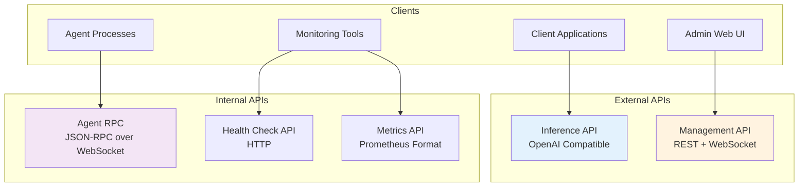

## API Structure

### Inference API (Client-Facing)

**Base URL**: `http://balancer:8080`

OpenAI-compatible endpoints for LLM inference:

```mermaid
graph LR
    subgraph "Inference Endpoints"
        COMPLETIONS[/v1/completions<br/>Text completion]
        CHAT[/v1/chat/completions<br/>Chat completion]
        EMBEDDINGS[/v1/embeddings<br/>Text embeddings]
        MODELS[/v1/models<br/>Available models]
    end
    
    subgraph "Features"
        STREAMING[Server-Sent Events]
        BATCHING[Batch Processing]
        ASYNC[Async Responses]
    end
    
    COMPLETIONS --> STREAMING
    CHAT --> STREAMING
    EMBEDDINGS --> BATCHING
    MODELS --> ASYNC
```

### Management API (Administrative)

**Base URL**: `http://balancer:8081`

Administrative control and monitoring:

```mermaid
graph LR
    subgraph "Management Endpoints"
        AGENTS[/agents<br/>Agent management]
        MODELS_MGMT[/models<br/>Model configuration]
        HEALTH_MGMT[/health<br/>System health]
        CONFIG[/config<br/>System configuration]
    end
    
    subgraph "Real-time APIs"
        WS_CONTROL[WebSocket Control<br/>Live updates]
        WS_LOGS[WebSocket Logs<br/>Log streaming]
        WS_METRICS[WebSocket Metrics<br/>Live metrics]
    end
    
    AGENTS --> WS_CONTROL
    MODELS_MGMT --> WS_CONTROL
    HEALTH_MGMT --> WS_METRICS
    CONFIG --> WS_LOGS
```

## Authentication and Security

### API Authentication

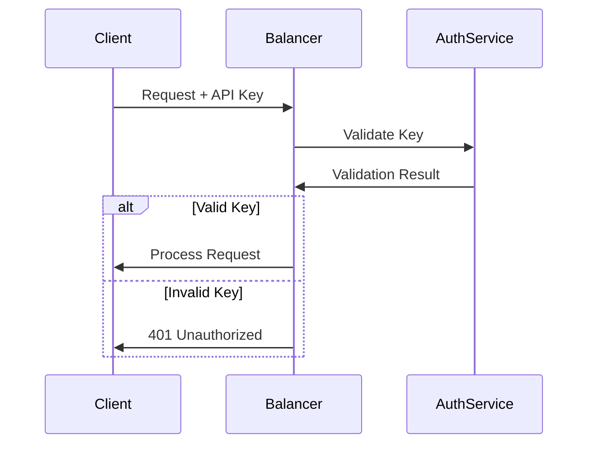

### Security Headers

All API responses include security headers:
- `X-Content-Type-Options: nosniff`
- `X-Frame-Options: DENY`
- `X-XSS-Protection: 1; mode=block`
- `Strict-Transport-Security: max-age=31536000`

## Protocol Specifications

### HTTP/REST API

Standard HTTP methods with JSON payloads:

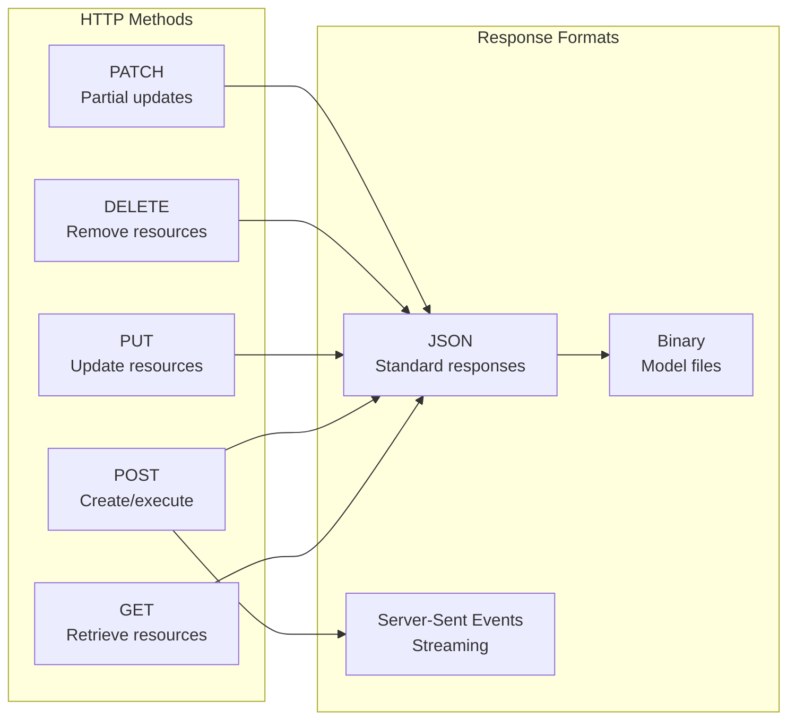

### WebSocket API

Real-time bidirectional communication:

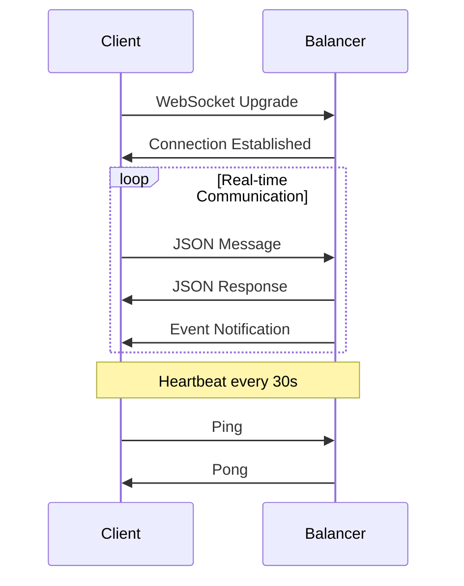

### JSON-RPC Protocol

Internal agent communication uses JSON-RPC 2.0:

```json
{
  "jsonrpc": "2.0",
  "method": "generate_tokens",
  "params": {
    "prompt": "Hello, world!",
    "max_tokens": 100,
    "temperature": 0.7
  },
  "id": "request-123"
}
```

## Error Handling

### HTTP Status Codes

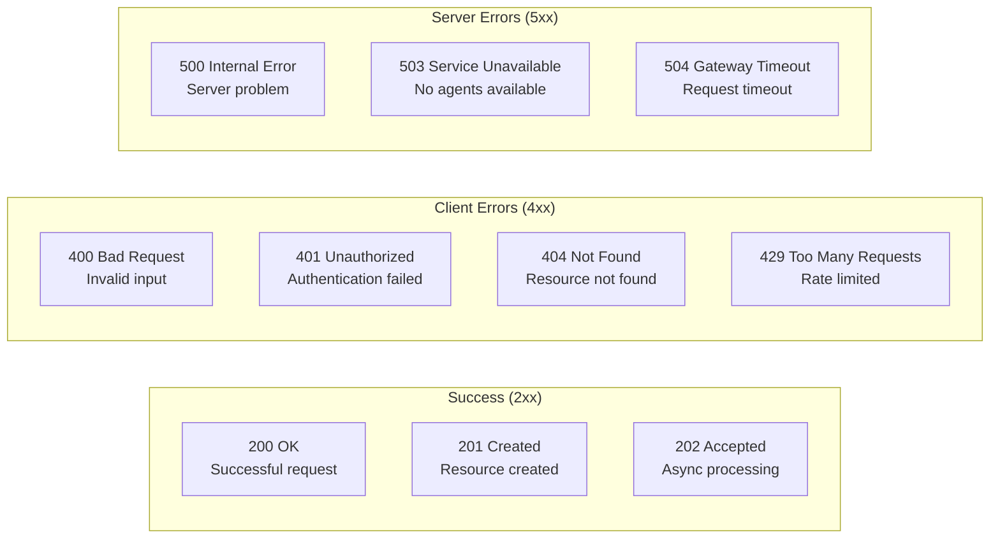

### Error Response Format

```json
{
  "error": {
    "code": "invalid_request",
    "message": "The request is missing required parameter 'prompt'",
    "details": {
      "parameter": "prompt",
      "received_value": null,
      "expected_type": "string"
    },
    "request_id": "req_123456789"
  }
}
```

## Rate Limiting and Quotas

### Rate Limiting Strategy

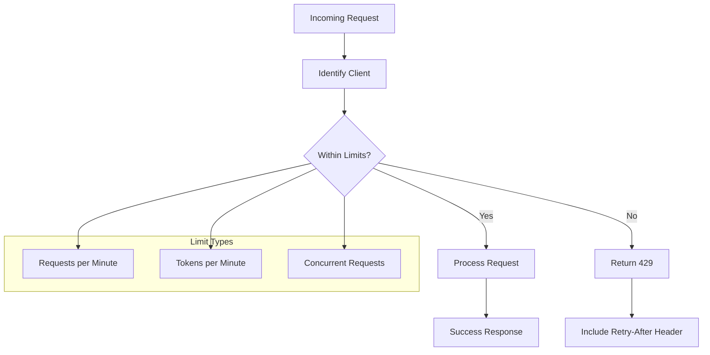

### Quota Management

Different quota tiers based on client classification:

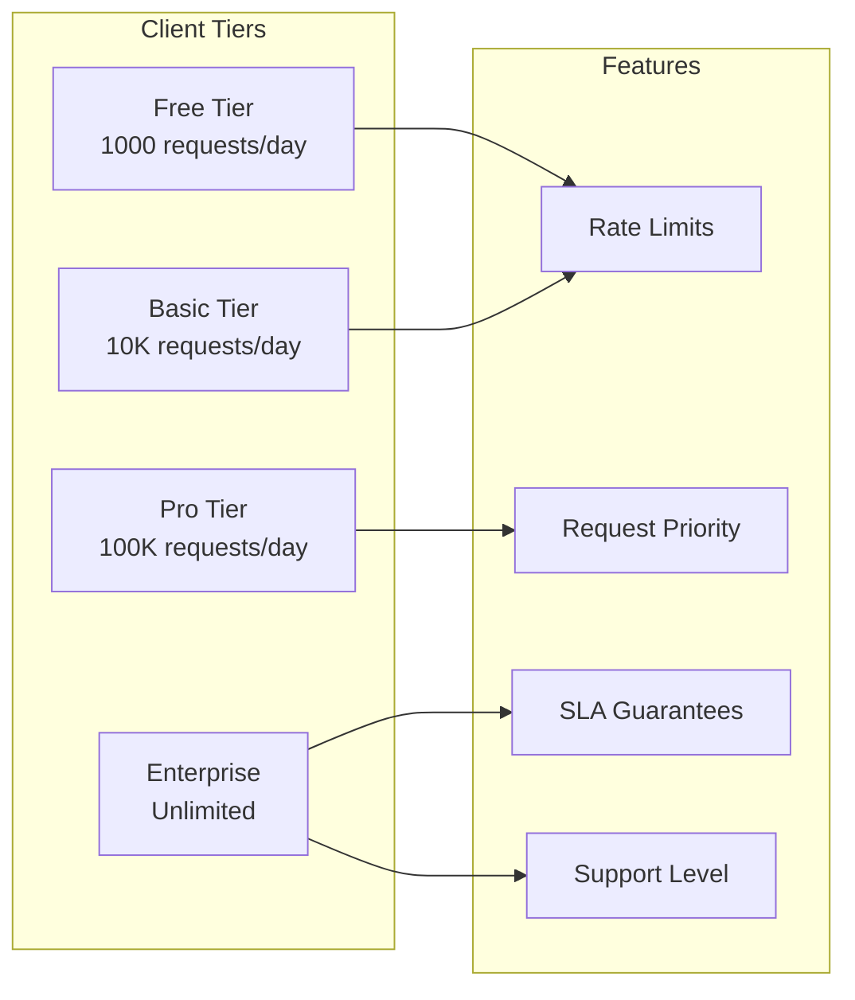

## API Documentation Structure

- **[Inference API](./inference-api.md)** - OpenAI-compatible inference endpoints
- **[Management API](./management-api.md)** - Administrative and configuration APIs
- **[WebSocket API](./websocket-api.md)** - Real-time communication protocols
- **[Internal APIs](./internal-apis.md)** - Agent communication and system APIs
- **[API Examples](./examples/)** - Code examples and tutorials
- **[API Reference](./reference/)** - Complete API specification

## OpenAPI Specification

Paddler provides OpenAPI 3.0 specifications for all APIs:

```yaml
openapi: 3.0.0
info:
  title: Paddler API
  version: 2.1.1
  description: LLMOps platform for hosting and scaling open-source LLMs
  contact:
    name: Intentee
    url: https://paddler.intentee.com
servers:
  - url: http://localhost:8080
    description: Local development server
  - url: https://api.paddler.example.com
    description: Production server
```

## SDK and Client Libraries

### Official SDKs

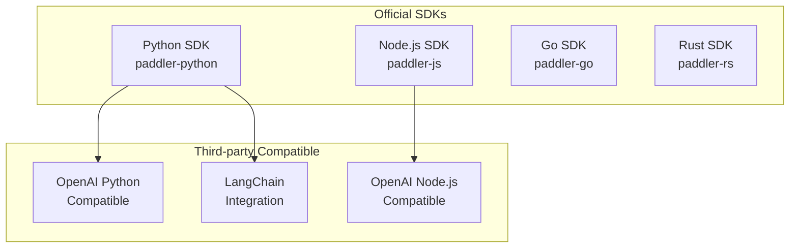

### Example Usage

```python
import paddler

# Initialize client
client = paddler.Client(
    api_key="your-api-key",
    base_url="http://paddler.example.com"
)

# Generate completion
response = client.completions.create(
    model="llama-7b",
    prompt="Hello, world!",
    max_tokens=100,
    stream=True
)

# Stream tokens
for token in response:
    print(token.choices[0].text, end="")
```

## Performance and Optimization

### Request Optimization

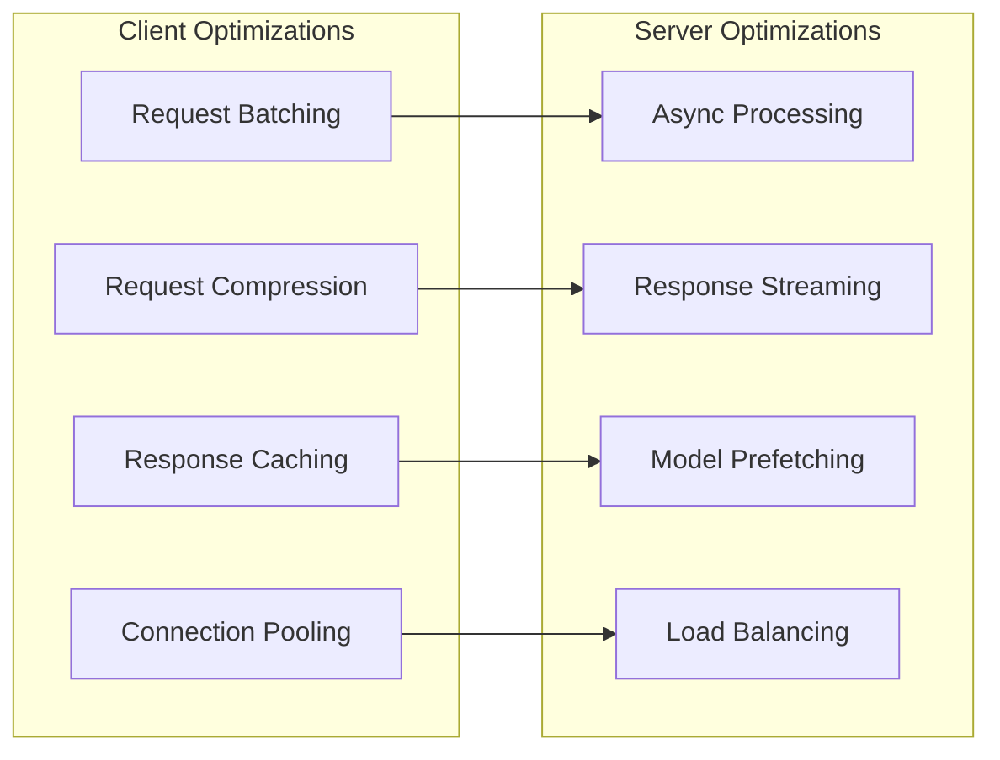

### API Versioning

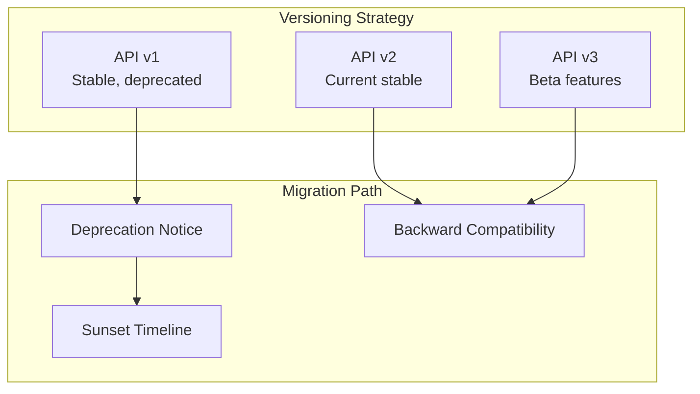

Version is specified in URL path: `/v1/completions`, `/v2/completions`

## Monitoring and Analytics

### API Metrics

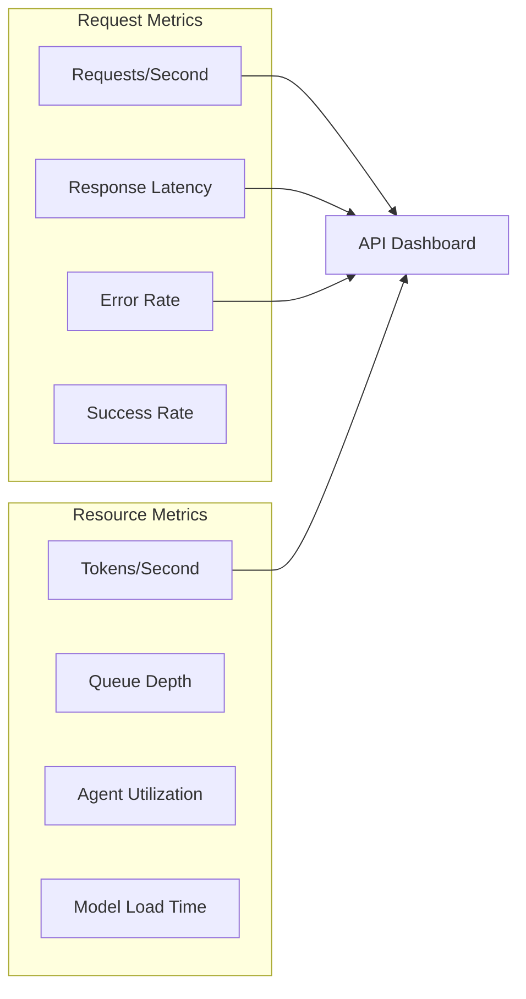

### Request Tracing

Each API request gets a unique trace ID for end-to-end tracking:

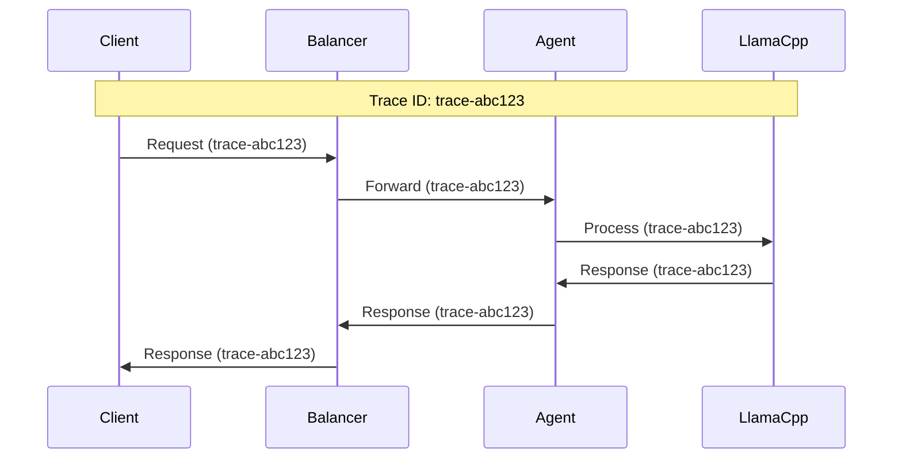