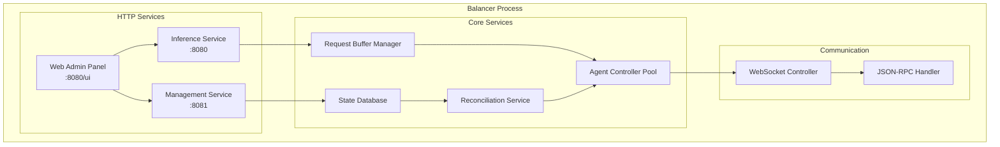
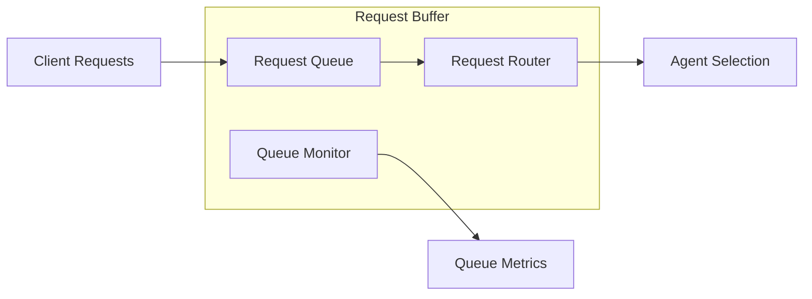
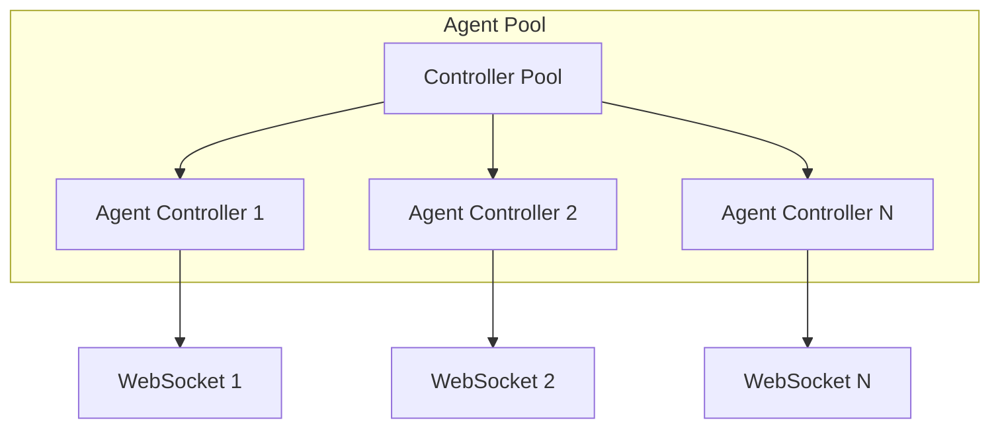
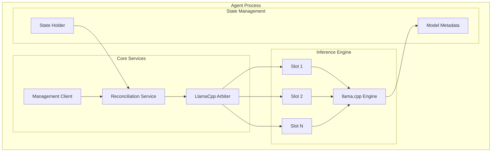
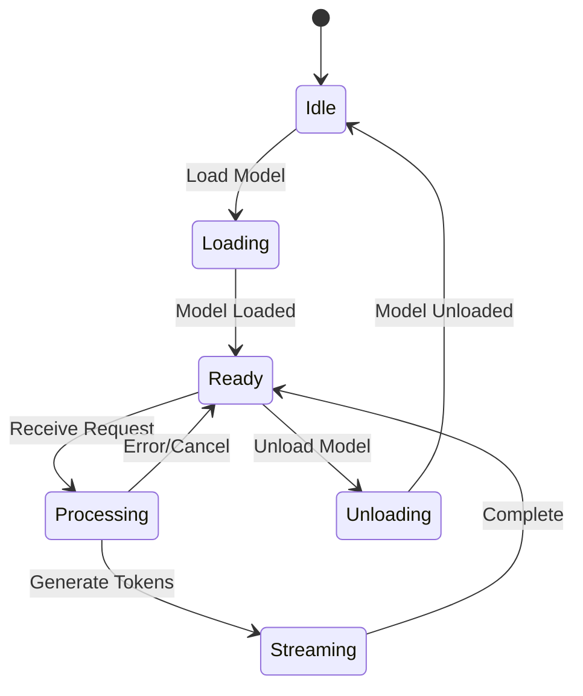
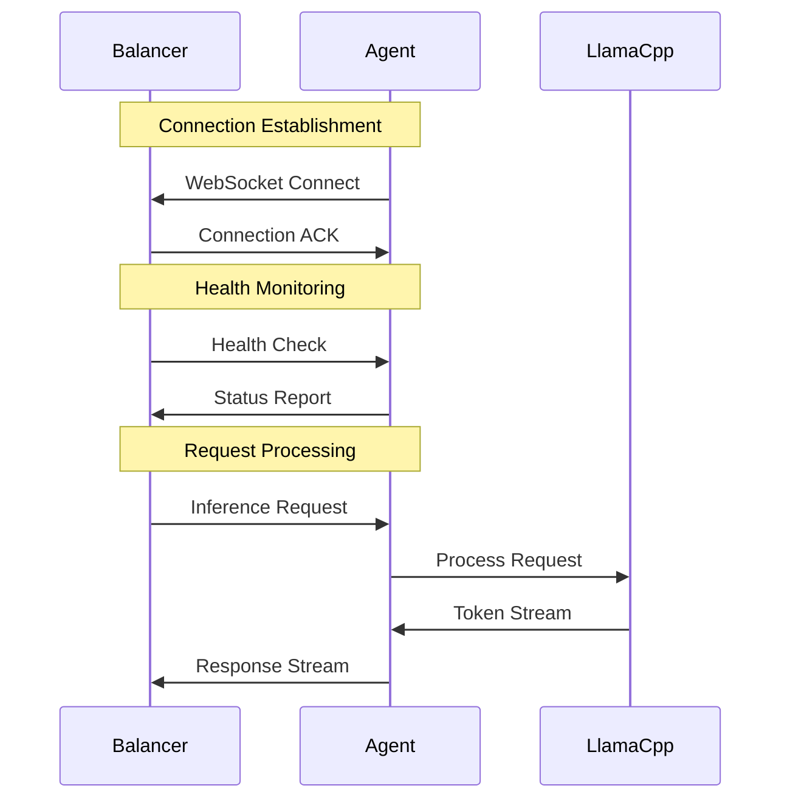
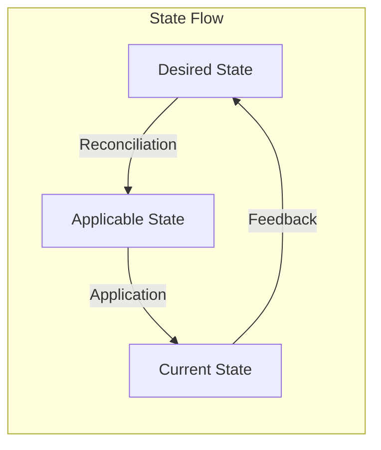

# Core Components

This document provides detailed information about Paddler's core components and their responsibilities.

## Balancer Components

### Architecture Overview

### Inference Service

**Purpose**: Handles client requests for token generation and embeddings.

**Key Responsibilities**:
- Accept HTTP requests for inference
- Validate request parameters
- Queue requests in buffer manager
- Stream responses back to clients
- Handle both completion and embedding requests

**API Endpoints**:
- `POST /v1/completions` - OpenAI-compatible completions
- `POST /v1/embeddings` - OpenAI-compatible embeddings
- `POST /v1/chat/completions` - OpenAI-compatible chat completions

### Management Service

**Purpose**: Provides administrative control over the Paddler system.

**Key Responsibilities**:
- Agent registration and health monitoring
- Model metadata management
- System configuration
- State synchronization
- Performance metrics collection

**API Endpoints**:
- `GET /agents` - List registered agents
- `POST /models` - Add/update model configurations
- `GET /metrics` - System performance metrics
- `GET /health` - System health status

### Request Buffer Manager

**Purpose**: Queues and manages incoming inference requests.

**Key Features**:
- FIFO request queuing
- Priority-based routing
- Queue overflow protection
- Request timeout handling
- Zero-agent graceful queuing

### Agent Controller Pool

**Purpose**: Manages connections and communication with agent fleet.

**Key Responsibilities**:
- Maintain WebSocket connections to agents
- Load balancing across agents
- Agent health monitoring
- Request distribution
- Response aggregation

## Agent Components

### Architecture Overview

### LlamaCpp Arbiter

**Purpose**: Coordinates access to the llama.cpp inference engine.

**Key Responsibilities**:
- Manage multiple inference slots
- Distribute requests across slots
- Handle model loading/unloading
- Monitor slot performance
- KV cache management

### Inference Slots

**Purpose**: Individual execution contexts for LLM inference.

**Key Features**:
- Separate KV cache per slot
- Independent context management
- Concurrent request processing
- Context length management
- Memory optimization

### Management Socket Client

**Purpose**: Maintains connection with balancer for control and monitoring.

**Key Responsibilities**:
- WebSocket connection management
- Health status reporting
- Configuration updates
- Model synchronization
- Performance metrics reporting

## Communication Patterns

### WebSocket Communication

### JSON-RPC Protocol

**Message Types**:
- `generate_tokens` - Token generation request
- `generate_embeddings` - Embedding generation request
- `health_status` - Health status update
- `model_update` - Model configuration change

### State Synchronization

## Error Handling and Recovery

### Agent Failure Handling

1. **Connection Loss**: Automatic reconnection with exponential backoff
2. **Slot Failures**: Isolated failure, other slots continue operating
3. **Model Loading Errors**: Graceful degradation, error reporting
4. **Memory Issues**: Automatic cleanup and restart procedures

### Balancer Resilience

1. **Agent Pool Management**: Removes failed agents from active pool
2. **Request Queuing**: Buffers requests during agent unavailability
3. **Health Monitoring**: Continuous agent health verification
4. **Graceful Degradation**: Reduced capacity rather than complete failure