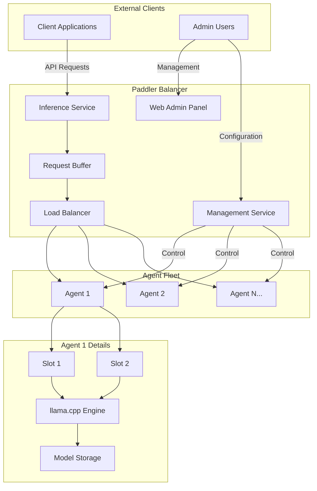
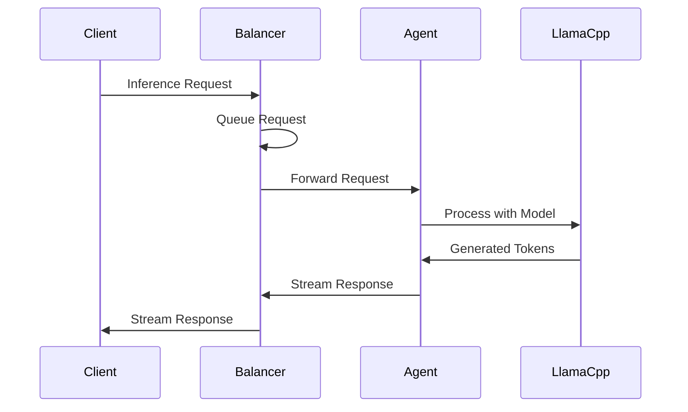

# Paddler System Overview

## High-Level Architecture

Paddler implements a distributed LLMOps platform with a two-tier architecture designed for scalability, reliability, and ease of management.

## System Components

### Balancer Components

- **Web Admin Panel**: User interface for system management and monitoring
- **Inference Service**: API endpoint for client applications to request tokens/embeddings
- **Management Service**: Internal service for managing agent fleet and system state
- **Request Buffer**: Queues incoming requests to enable zero-downtime scaling
- **Load Balancer**: Distributes requests across available agents

### Agent Components

- **Agent**: Individual inference worker that connects to the balancer
- **Slots**: Execution contexts within an agent that maintain separate KV caches
- **llama.cpp Engine**: The actual LLM inference engine
- **Model Storage**: Local or shared storage for model files

## Key Architectural Characteristics

### Scalability
- **Horizontal Scaling**: Add/remove agents dynamically based on load
- **Slot-Level Parallelism**: Multiple inference contexts per agent
- **Request Buffering**: System can scale from zero agents to handle burst traffic

### Reliability
- **Agent Fault Tolerance**: System continues operating when agents fail
- **Health Monitoring**: Continuous monitoring of agent and slot status
- **Graceful Degradation**: Reduced capacity rather than complete failure

### Flexibility
- **Dynamic Model Loading**: Change models without system restart
- **Multi-Model Support**: Different agents can run different models
- **Custom Chat Templates**: Configurable prompt formatting

## Data Flow Overview

## Deployment Patterns

### Single-Node Development
- Balancer and Agent on same machine
- Suitable for development and testing

### Multi-Node Production
- Balancer on dedicated coordinator nodes
- Agents distributed across inference nodes
- Shared or distributed model storage

### Cloud-Native
- Kubernetes-ready architecture
- Container-based deployment
- Auto-scaling capabilities

## Technology Stack

- **Core Runtime**: Rust (async/await with Tokio)
- **Inference Engine**: llama.cpp integration
- **Web Framework**: Actix Web
- **Frontend**: React with TypeScript
- **Communication**: WebSockets + HTTP/JSON-RPC
- **State Management**: In-memory with persistence options