# Component Details

This section provides in-depth documentation for each major component in the Paddler system.

## Component Overview

Paddler's architecture consists of several key components working together to provide scalable LLM inference:

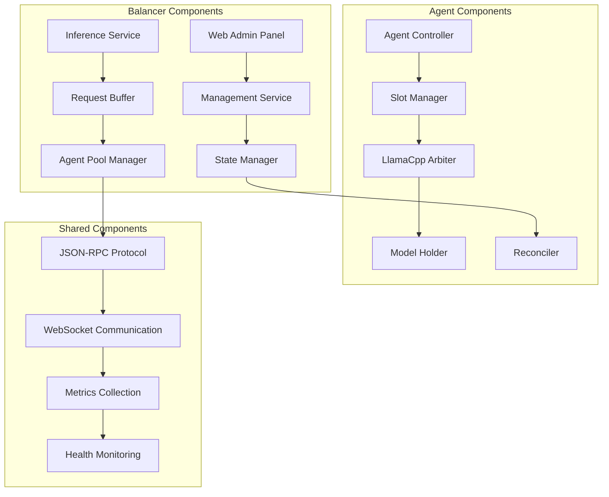

## Documentation Structure

### Core Infrastructure
- **[Request Buffer Manager](./request-buffer.md)** - Request queuing and routing
- **[Agent Pool Manager](./agent-pool.md)** - Agent lifecycle and load balancing
- **[State Management](./state-management.md)** - Distributed state synchronization
- **[Health Monitoring](./health-monitoring.md)** - System health and diagnostics

### Inference Components
- **[LlamaCpp Integration](./llamacpp-integration.md)** - LLM inference engine wrapper
- **[Slot Management](./slot-management.md)** - Concurrent inference contexts
- **[Model Management](./model-management.md)** - Model loading and caching
- **[Response Streaming](./response-streaming.md)** - Real-time token streaming

### Communication Layer
- **[WebSocket Management](./websocket-management.md)** - Real-time communication
- **[JSON-RPC Protocol](./jsonrpc-protocol.md)** - Inter-component messaging
- **[HTTP Services](./http-services.md)** - REST API implementation

### User Interface
- **[Web Admin Panel](./web-admin-panel.md)** - Management interface
- **[React Frontend](./react-frontend.md)** - UI component architecture
- **[API Gateway](./api-gateway.md)** - Request routing and validation

## Component Interaction Patterns

### Request Processing Flow

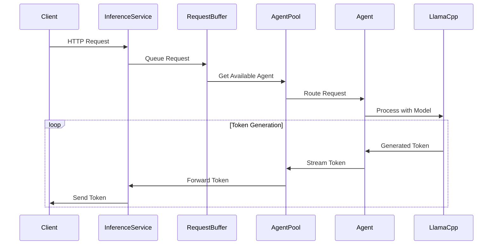

### State Synchronization Flow

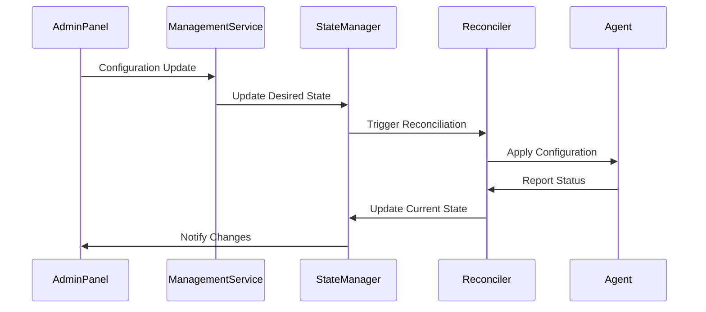

## Component Dependencies

### Dependency Graph

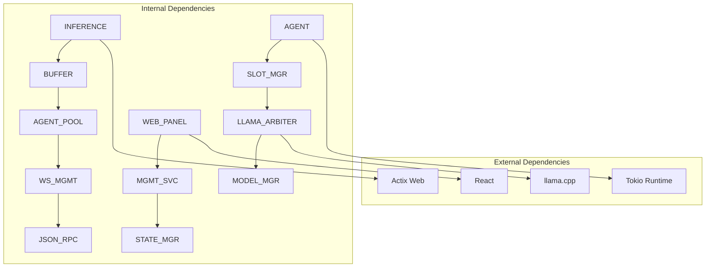

### Startup Dependencies

Components must start in a specific order to ensure proper initialization:

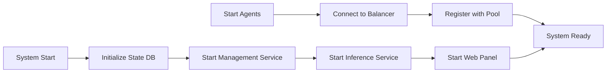

## Component Interfaces

### Internal APIs

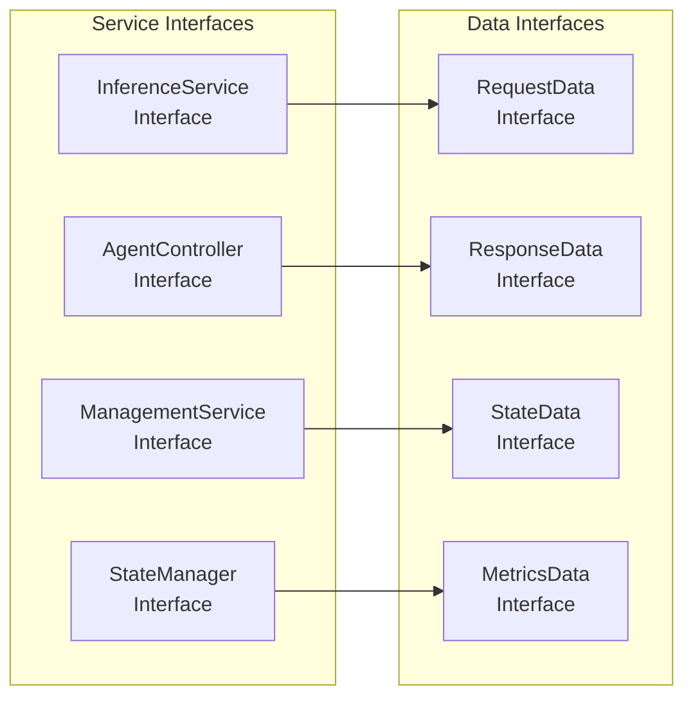

### Message Protocols

Each component communicates using well-defined message protocols:

```rust
// Example message types
pub struct InferenceRequest {
    pub id: String,
    pub model: String,
    pub prompt: String,
    pub parameters: InferenceParameters,
}

pub struct AgentStatus {
    pub agent_id: String,
    pub health: HealthStatus,
    pub slots: Vec<SlotStatus>,
    pub metrics: AgentMetrics,
}

pub struct StateUpdate {
    pub component: ComponentId,
    pub desired_state: State,
    pub current_state: State,
    pub timestamp: Timestamp,
}
```

## Performance Characteristics

### Component Performance Profiles

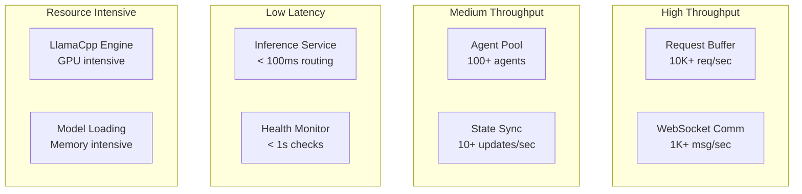

### Scalability Limits

Each component has different scaling characteristics:

| Component | Horizontal Scaling | Vertical Scaling | Bottlenecks |
|-----------|-------------------|------------------|-------------|
| Balancer | Limited (1-3 instances) | High (CPU/Memory) | State consistency |
| Agents | Unlimited | High (GPU/Memory) | Model loading |
| Request Buffer | High | Medium | Memory usage |
| State Manager | Limited | High | Write consistency |

## Error Handling Strategies

### Component-Level Error Handling

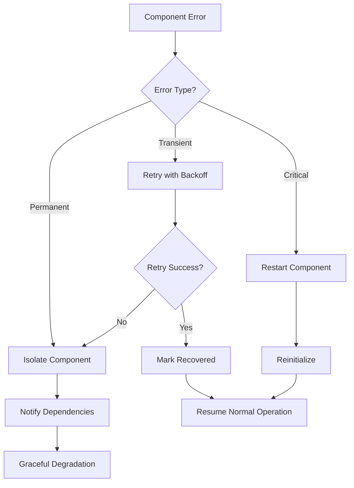

### Circuit Breaker Pattern

Components implement circuit breakers to prevent cascade failures:

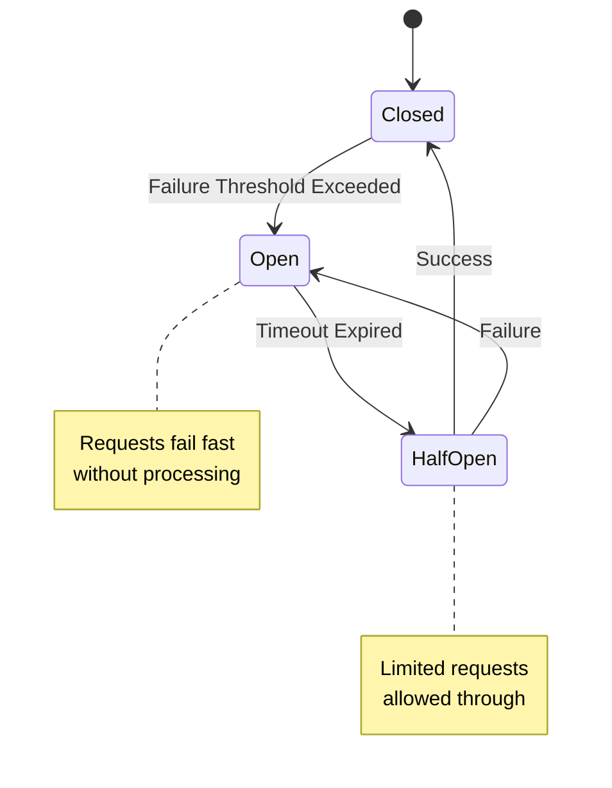

## Testing Strategies

### Component Testing

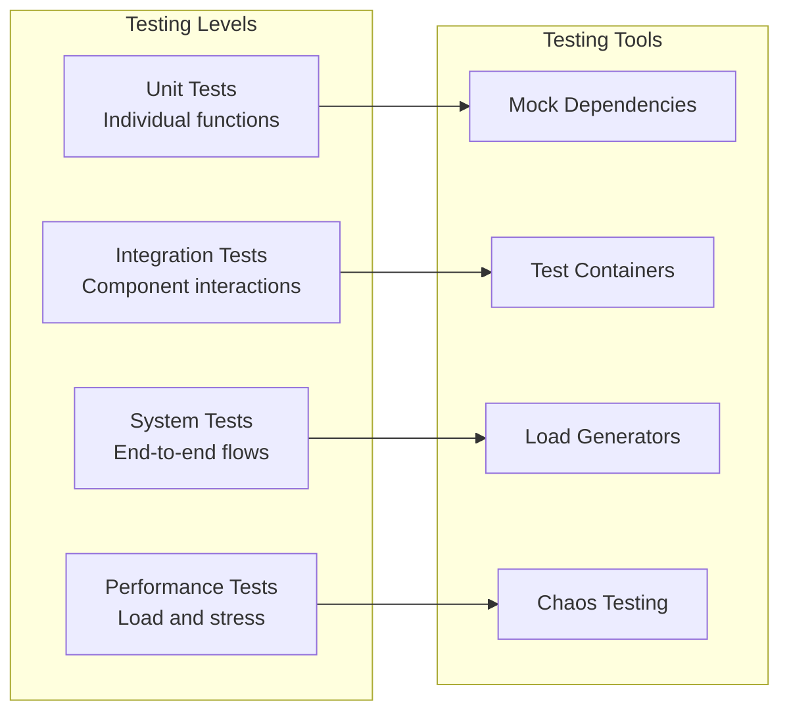

### Component Isolation

Each component can be tested in isolation using:

1. **Mock Dependencies**: Simulate other components
2. **Test Doubles**: Replace external services
3. **Dependency Injection**: Swap implementations
4. **Configuration Overrides**: Modify behavior for testing

## Monitoring and Observability

### Component Metrics

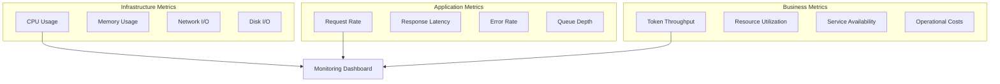

### Distributed Tracing

Each request receives a trace ID that follows it through all components:

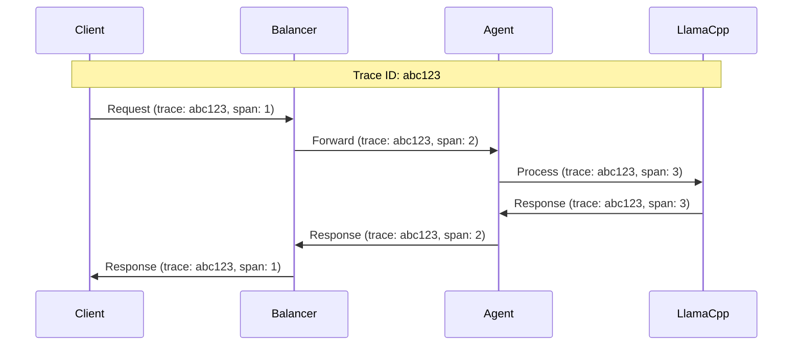

## Development Guidelines

### Component Development Best Practices

1. **Single Responsibility**: Each component has one clear purpose
2. **Loose Coupling**: Minimize dependencies between components
3. **Interface Segregation**: Use minimal, focused interfaces
4. **Dependency Inversion**: Depend on abstractions, not concrete implementations
5. **Error Handling**: Comprehensive error handling and recovery
6. **Observability**: Built-in logging, metrics, and tracing
7. **Testability**: Design for easy testing and mocking

### Code Organization

```
src/
├── components/           # Component implementations
│   ├── balancer/        # Balancer-specific components
│   ├── agent/           # Agent-specific components
│   └── shared/          # Shared components
├── interfaces/          # Component interfaces
├── protocols/           # Communication protocols
├── utils/              # Utility functions
└── tests/              # Component tests
```