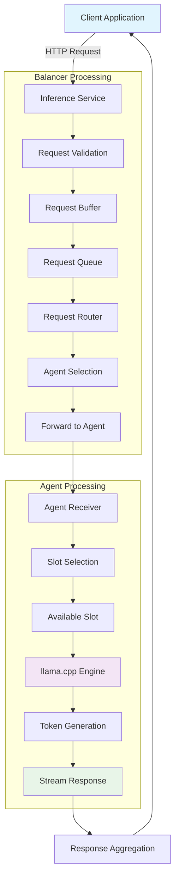
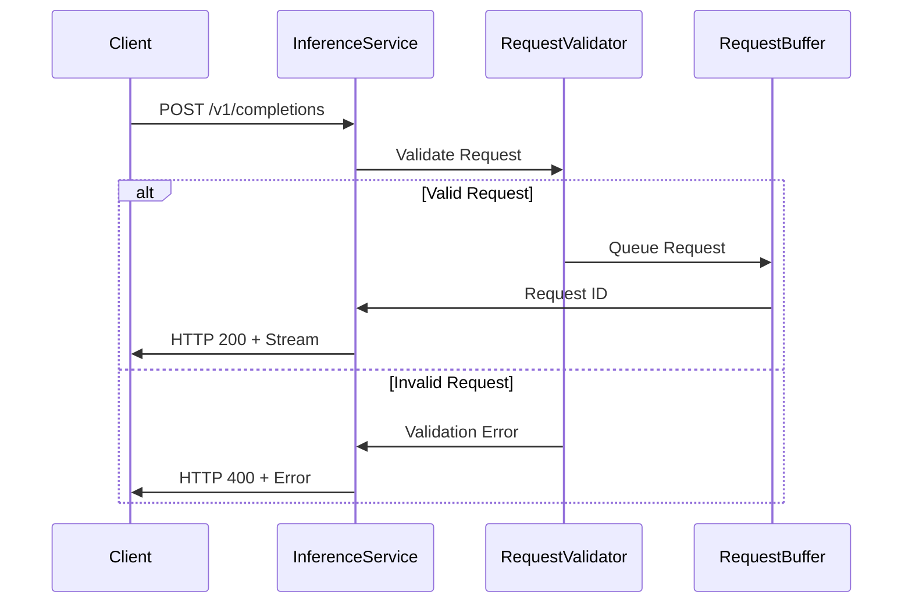
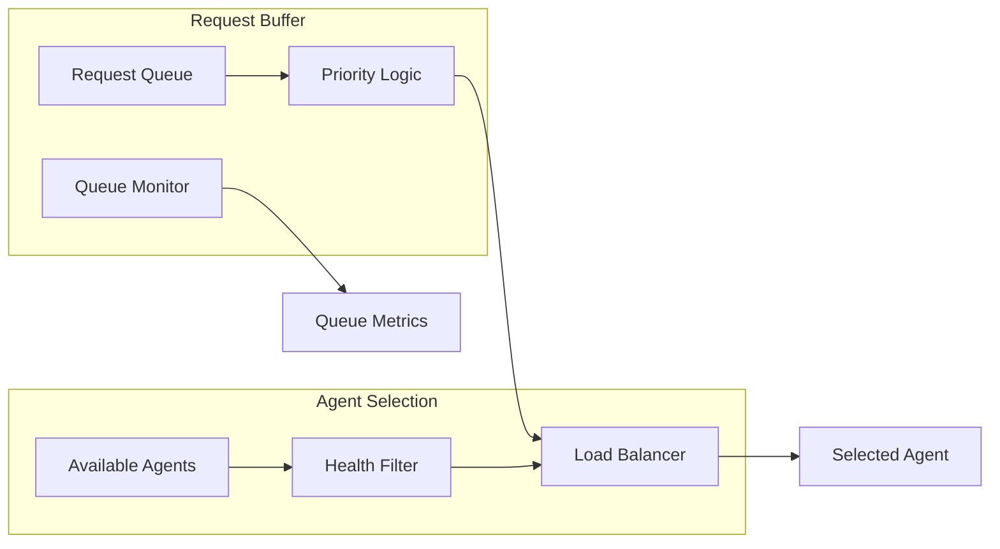
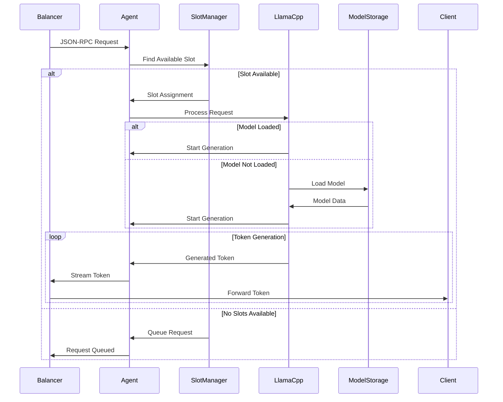
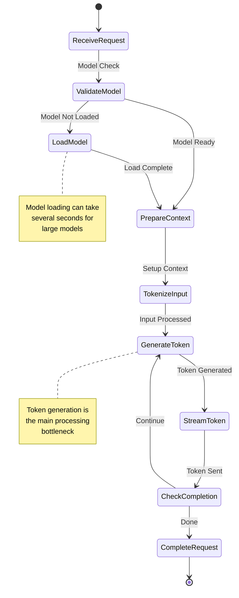
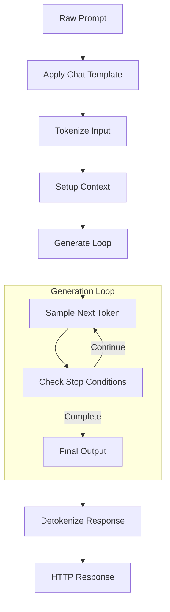
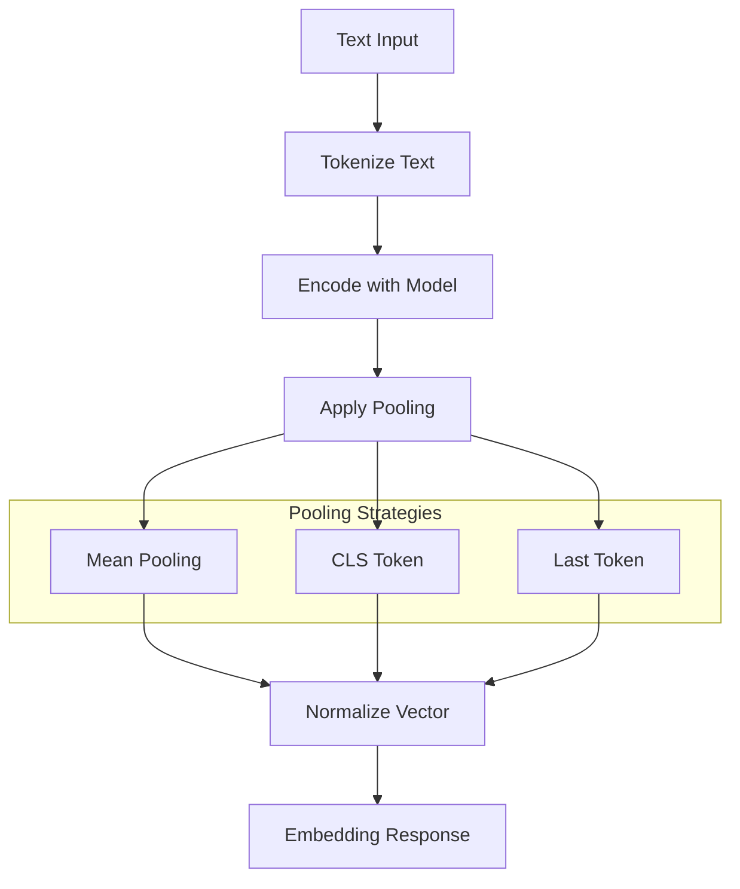
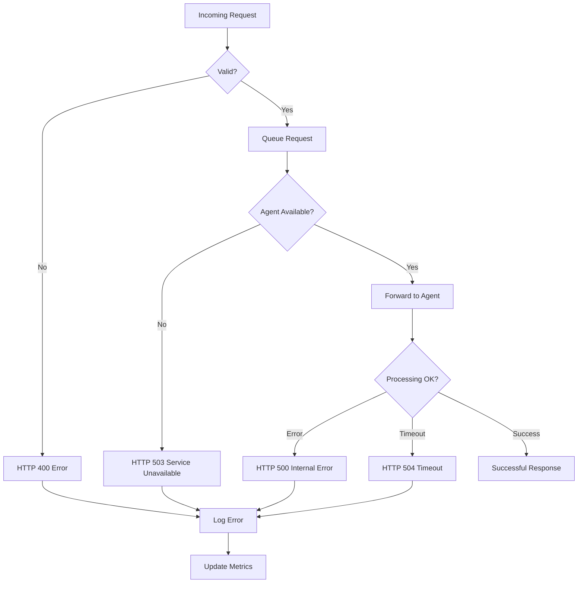
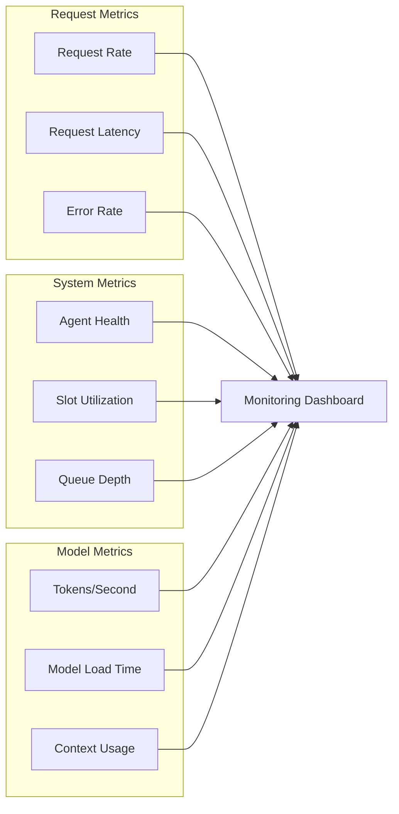

# Request Processing Flow

This document details how requests flow through the Paddler system from initial client request to final response.

## Complete Request Lifecycle

## Detailed Request Flow

### 1. Request Reception

**Request Validation Steps**:
1. JSON schema validation
2. Parameter range checks
3. Authentication verification
4. Rate limiting enforcement
5. Model availability check

### 2. Request Queuing and Routing

**Selection Criteria**:
- Agent health status
- Current load/slot availability
- Model compatibility
- Geographic proximity (if applicable)
- Historical performance

### 3. Agent Request Processing

### 4. Token Generation Flow

## Request Types and Processing

### Completion Requests

### Embedding Requests

## Performance Characteristics

### Latency Breakdown

```mermaid
gantt
    title Request Processing Timeline
    dateFormat X
    axisFormat %s
    
    section Network
    Client to Balancer    :0, 10
    Balancer to Agent     :10, 15
    Agent to Client       :95, 100
    
    section Processing
    Request Validation    :5, 8
    Queue Processing      :8, 12
    Agent Selection       :12, 15
    Model Processing      :15, 95
    
    section Model Work
    Context Setup         :15, 20
    Token Generation      :20, 90
    Response Assembly     :90, 95
```

### Throughput Optimization

**Bottleneck Identification**:
1. **Model Loading**: Cache models in memory
2. **Token Generation**: Optimize batch processing
3. **Network**: Use efficient serialization
4. **Queue Processing**: Parallel request handling

**Scaling Strategies**:
- Horizontal agent scaling
- Slot multiplexing
- Request batching
- Model sharding

## Error Handling in Request Flow

### Error Recovery Strategies

1. **Request Retry**: Automatic retry on transient failures
2. **Agent Failover**: Route to different agent on failure
3. **Graceful Degradation**: Reduced functionality vs complete failure
4. **Circuit Breaker**: Prevent cascade failures

## Monitoring and Observability

### Key Metrics

### Distributed Tracing

Each request receives a trace ID that follows it through:
- Request validation
- Queue processing
- Agent selection
- Model processing
- Response generation

This enables end-to-end performance analysis and debugging.