# Deployment Architecture

This section covers various deployment patterns and architectural considerations for running Paddler in production.

## Overview

Paddler supports multiple deployment architectures depending on:
- Scale requirements
- Infrastructure constraints
- High availability needs
- Resource optimization goals

## Deployment Patterns

### Single-Node Development

Perfect for development, testing, and small-scale deployments.

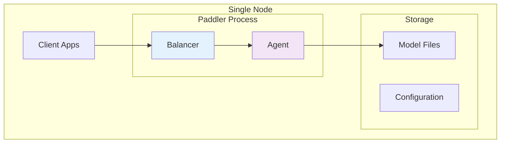

**Characteristics**:
- Single `paddler` process running both balancer and agent
- Local model storage
- Minimal resource requirements
- Easy debugging and development

**Configuration**:
```bash
# Start balancer
paddler balancer --bind 0.0.0.0:8080

# Start agent (in separate terminal)
paddler agent --balancer-url http://localhost:8081
```

### Multi-Node Production

Recommended for production workloads requiring scale and reliability.

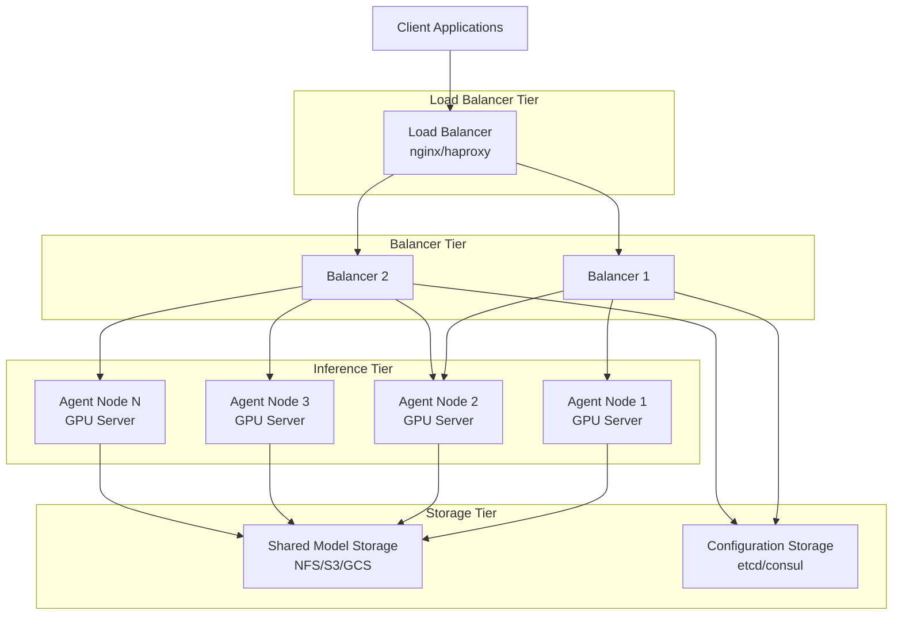

**Characteristics**:
- Separate balancer and agent nodes
- Horizontal scaling of both tiers
- Shared storage for models and configuration
- High availability through redundancy

### Kubernetes Deployment

Cloud-native deployment with auto-scaling and orchestration.

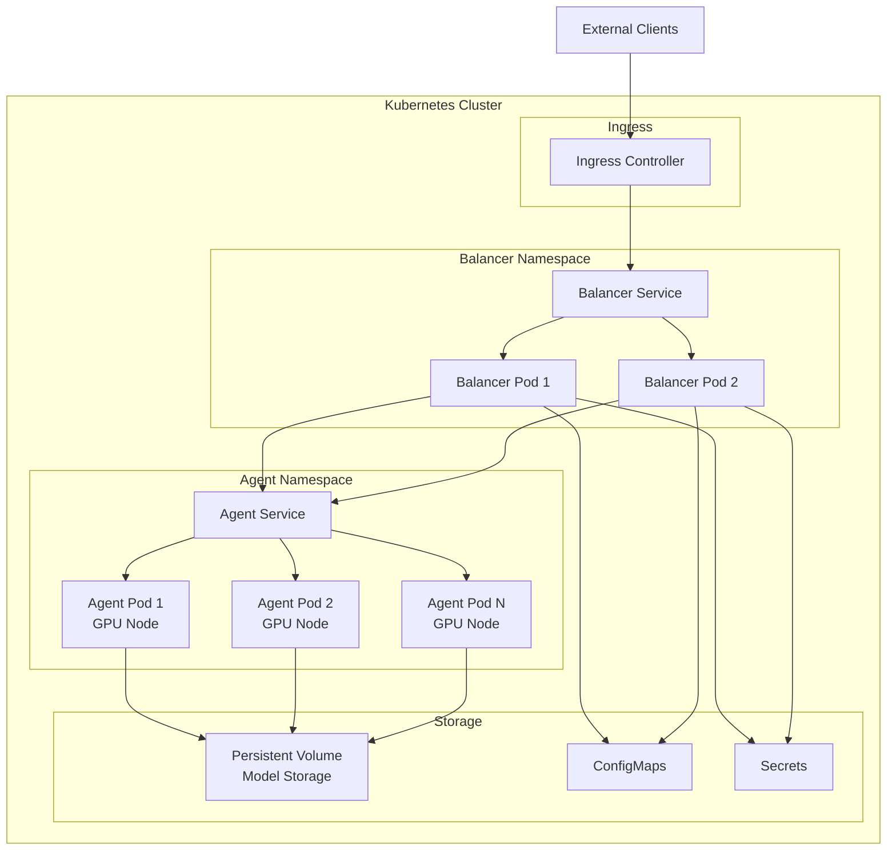

## Infrastructure Considerations

### Hardware Requirements

#### Balancer Nodes
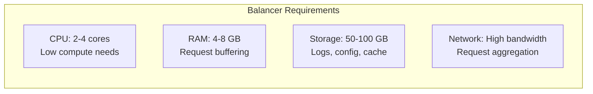

**Specifications**:
- **CPU**: 2-4 cores (request handling is I/O bound)
- **Memory**: 4-8 GB (request buffering and caching)
- **Storage**: 50-100 GB SSD (logs, configuration, temporary files)
- **Network**: High bandwidth for request aggregation

#### Agent Nodes
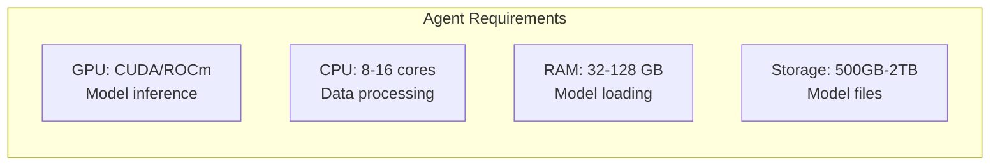

**Specifications**:
- **GPU**: NVIDIA/AMD GPU with CUDA/ROCm support
- **CPU**: 8-16 cores for data preprocessing
- **Memory**: 32-128 GB (depends on model size)
- **Storage**: 500GB-2TB NVMe SSD for model storage

### Network Architecture

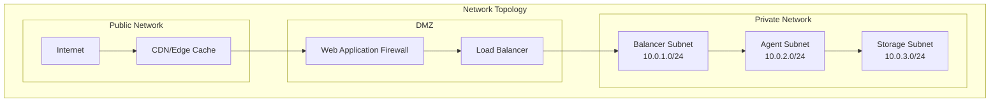

**Network Security**:
- Firewall rules restricting inter-subnet communication
- VPN access for management
- TLS encryption for all communications
- Network segmentation for multi-tenancy

## Scaling Strategies

### Horizontal Scaling

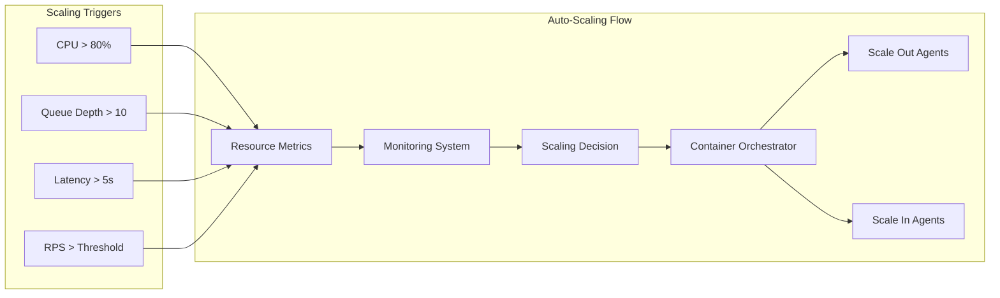

### Vertical Scaling

For single-node deployments or when horizontal scaling isn't possible:

1. **Increase Slot Count**: More concurrent inference contexts per agent
2. **Upgrade Hardware**: Better GPU, more RAM, faster storage
3. **Optimize Models**: Use quantized or smaller models
4. **Tune Parameters**: Optimize context length and batch sizes

## High Availability Setup

### Multi-Region Deployment

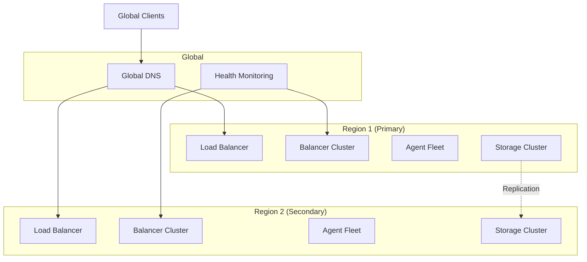

### Failover Strategies

1. **Active-Passive**: Primary region handles all traffic, secondary on standby
2. **Active-Active**: Both regions handle traffic with geographic routing
3. **Circuit Breaker**: Automatic failover when health checks fail
4. **Graceful Degradation**: Reduced service vs complete outage

## Monitoring and Observability

### Deployment Metrics

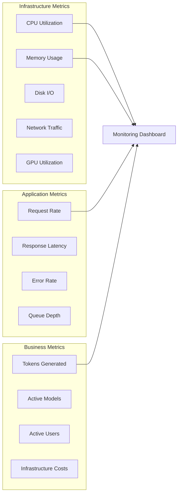

### Logging Strategy

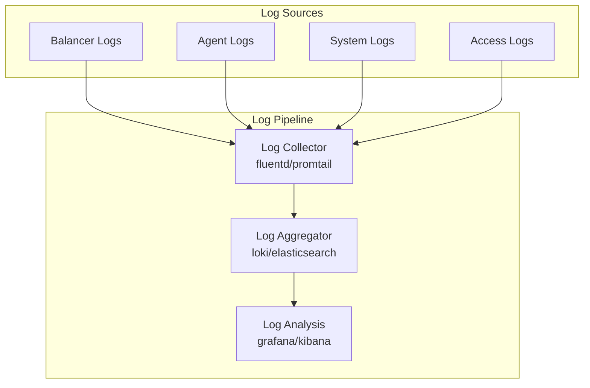

## Security Considerations

### Network Security
- TLS 1.3 for all communications
- mTLS for internal service communication
- Network policies restricting pod-to-pod communication
- VPN for administrative access

### Data Security
- Encryption at rest for model files
- Secure credential management
- Request/response data encryption
- Audit logging for compliance

### Access Control
- Role-based access control (RBAC)
- API key authentication
- Rate limiting and quotas
- Request validation and sanitization

## Cost Optimization

### Resource Optimization

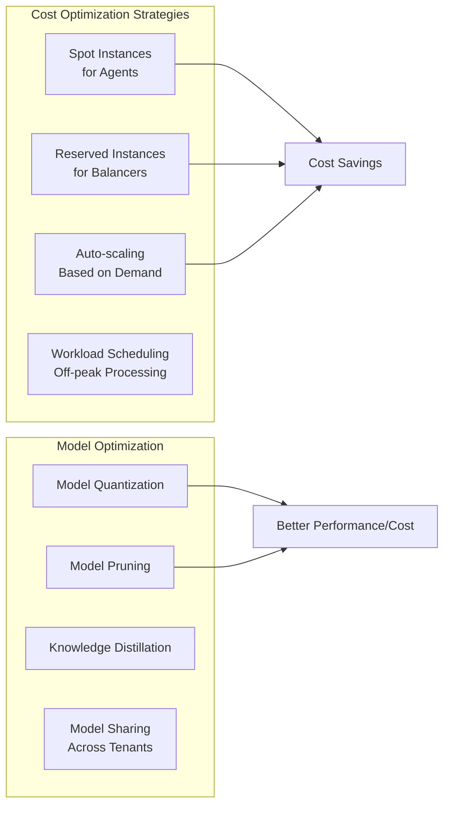

### Multi-Tenancy

Sharing infrastructure across multiple users or applications:

1. **Namespace Isolation**: Kubernetes namespaces for tenant separation
2. **Resource Quotas**: CPU/memory limits per tenant
3. **Model Sharing**: Same models serve multiple tenants
4. **Request Prioritization**: SLA-based request prioritization