# State Management Architecture

This document details how Paddler manages state across distributed components and maintains consistency in a dynamic system.

## State Management Overview

Paddler implements a distributed state management system that ensures consistency between the desired system configuration and the actual runtime state across all components.

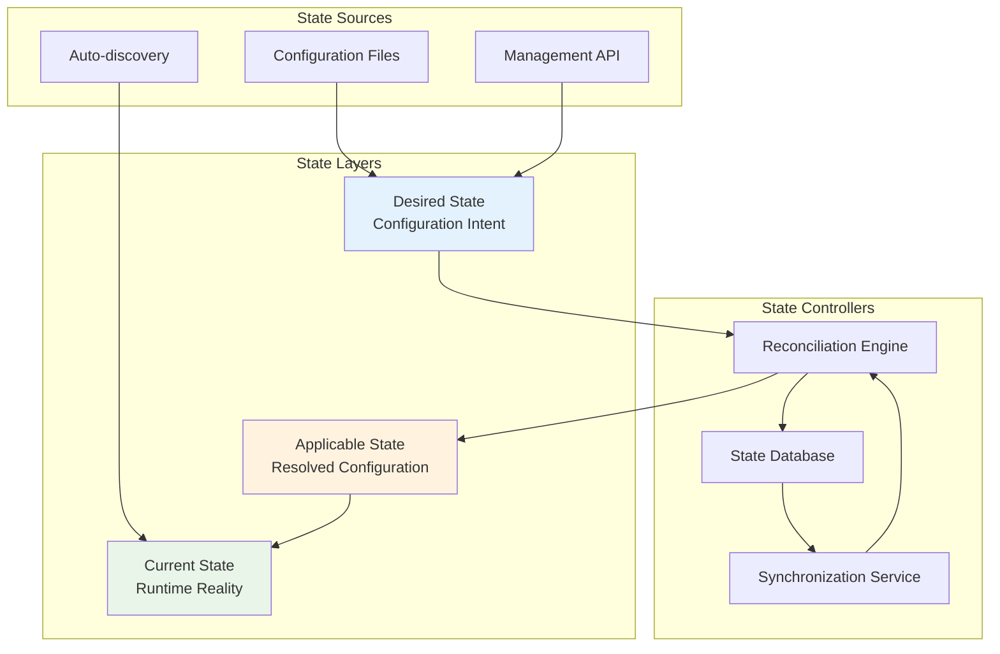

## State Types and Scope

### System-Level State

**Balancer State**:
- Registered agents and their health
- Available models and metadata
- System configuration and policies
- Performance metrics and history

**Agent State**:
- Slot availability and status
- Loaded models and their versions
- Resource utilization metrics
- Connection status to balancer

### Request-Level State

**Active Requests**:
- Request queue contents
- In-progress inference tasks
- Streaming response sessions
- Request routing decisions

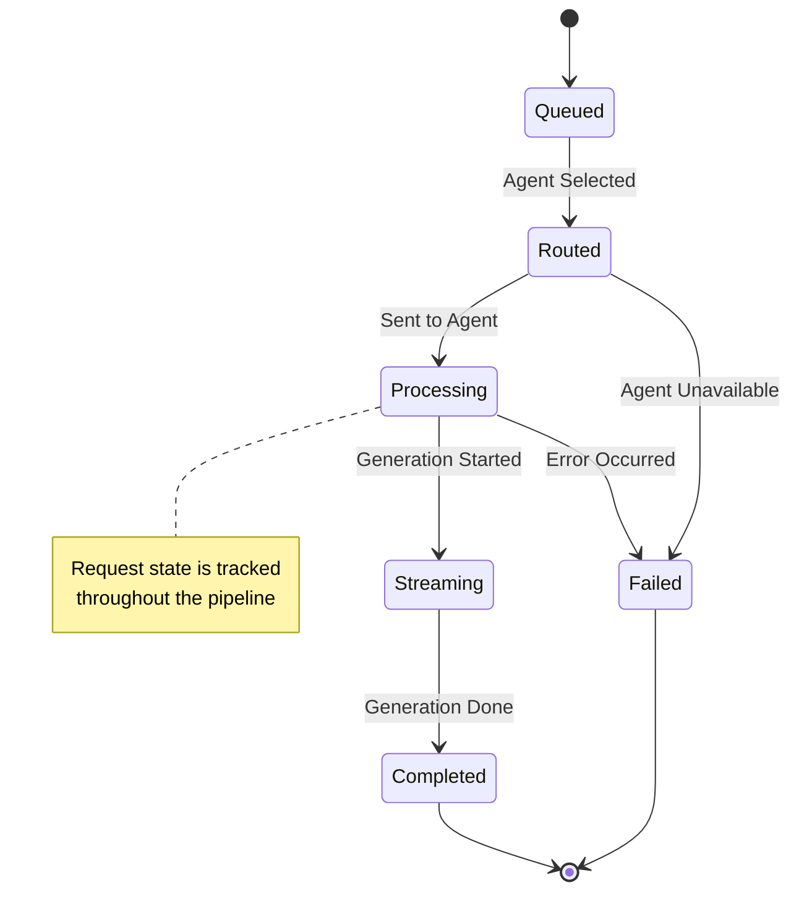

## Desired State Specification

### Configuration Schema

Paddler uses a declarative configuration model where operators specify the desired end state:

```yaml
# Example desired state configuration
agents:
  - id: "agent-1"
    desired_model:
      source: "huggingface"
      model_id: "microsoft/DialoGPT-medium"
      revision: "main"
    slots: 4
    max_context_length: 2048
    
  - id: "agent-2"  
    desired_model:
      source: "local"
      path: "/models/llama-7b.gguf"
    slots: 2
    max_context_length: 4096

models:
  - id: "default-chat"
    chat_template: |
      
      {{ message.role }}: {{ message.content }}
      
    parameters:
      temperature: 0.7
      top_p: 0.9
      max_tokens: 1024
```

### State Validation

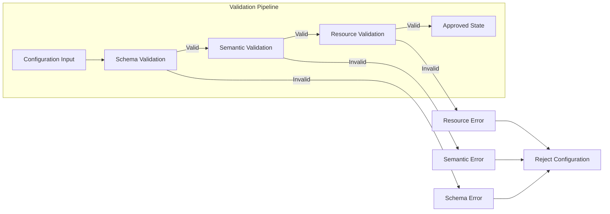

## State Reconciliation Process

### Reconciliation Loop

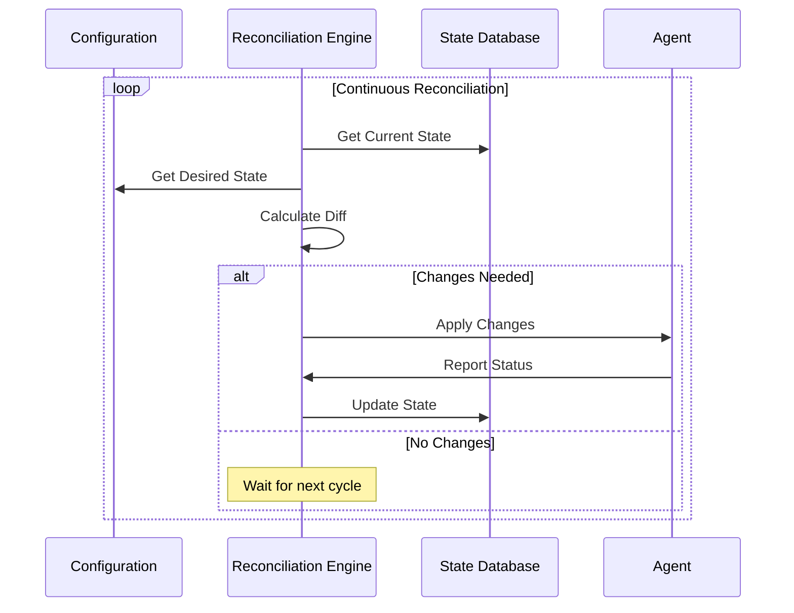

### Conflict Resolution

When multiple sources attempt to modify state simultaneously:

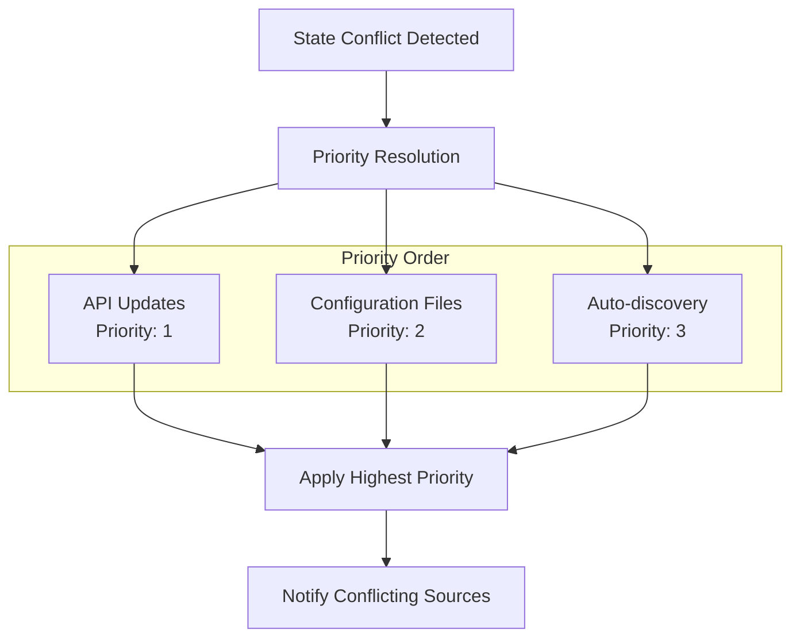

## State Synchronization Patterns

### Event-Driven Synchronization

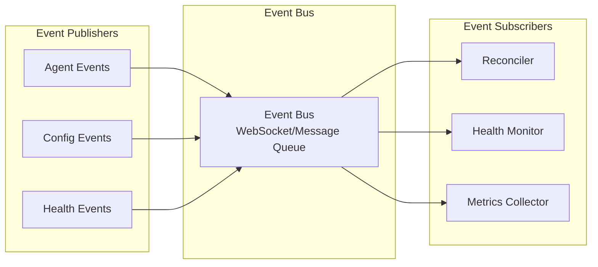

### Periodic Synchronization

Complements event-driven updates with periodic full synchronization:

```mermaid
gantt
    title State Synchronization Timeline
    dateFormat X
    axisFormat %s
    
    section Health Checks
    Agent Health       :0, 30
    Model Status       :30, 60
    Resource Check     :60, 90
    
    section State Sync
    Incremental Sync   :active, 0, 10
    Incremental Sync   :active, 10, 20
    Full Sync         :crit, 60, 70
    Incremental Sync   :active, 70, 80
```

## State Persistence and Recovery

### State Database Schema

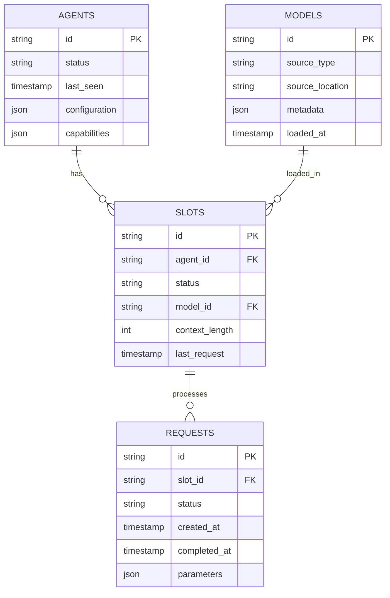

### Recovery Mechanisms

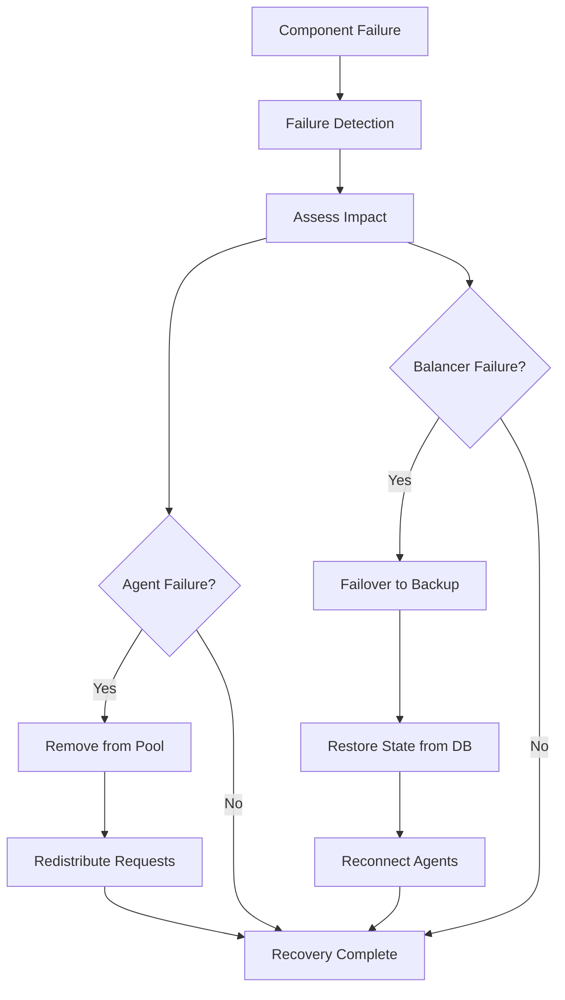

## Distributed State Challenges

### Network Partitions

Handling network splits between balancer and agents:

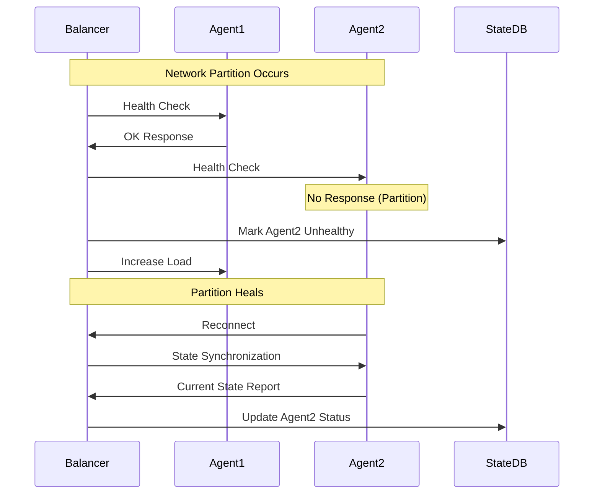

### Eventual Consistency

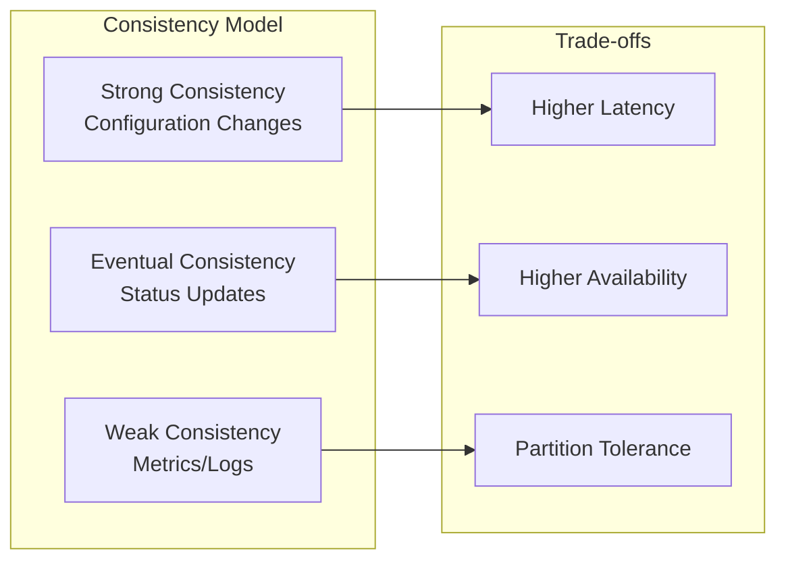

## State Monitoring and Debugging

### State Inspection Tools

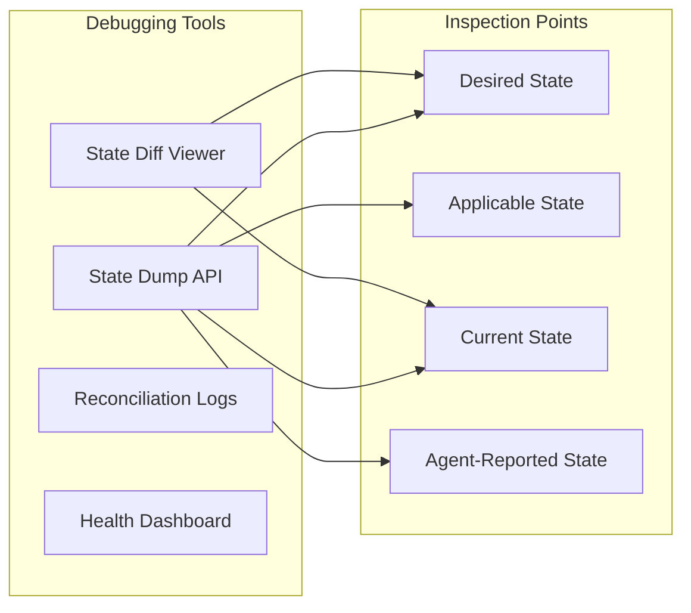

### State Divergence Alerts

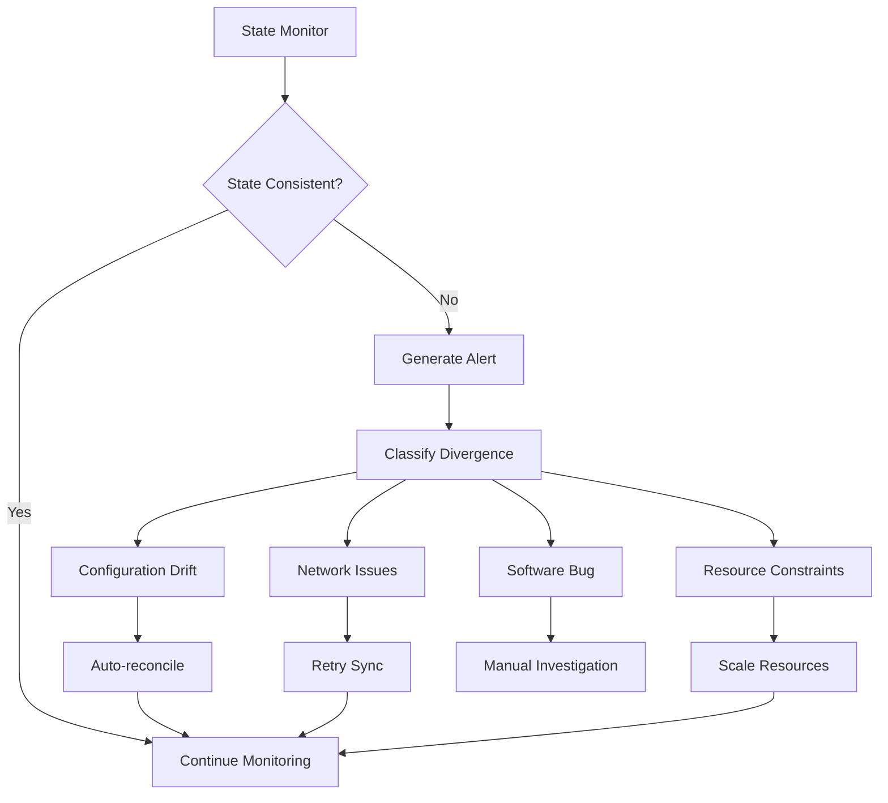

## Best Practices

### State Management Guidelines

1. **Immutable State**: Treat state changes as creating new versions
2. **Event Sourcing**: Maintain history of state changes for debugging
3. **Graceful Degradation**: System continues with partial state loss
4. **Conflict Avoidance**: Design to minimize state conflicts
5. **Observability**: Comprehensive logging and monitoring of state changes

### Performance Optimization

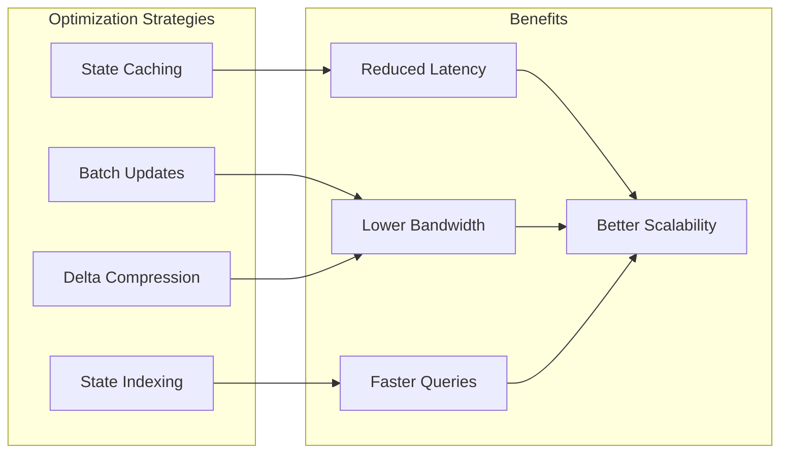

### Testing State Management

1. **Chaos Testing**: Simulate network partitions and failures
2. **State Consistency Tests**: Verify state converges after disruptions
3. **Performance Testing**: Measure state sync latency under load
4. **Recovery Testing**: Validate recovery from various failure scenarios